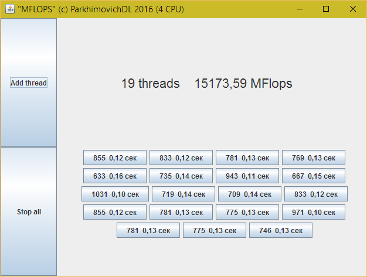

# MFLOPS
Мультипоточный измеритель производительности системы в MFlops.

Показывает время выполнения 100 млн. операций умножения с плавающей точкой для потока.

Эквайринг

<iframe frameborder="0" allowtransparency="true" scrolling="no" src="https://money.yandex.ru/embed/shop.xml?account=410014358450983&quickpay=shop&payment-type-choice=on&writer=seller&targets=%D0%97%D0%B0+%D0%BA%D0%BE%D0%BD%D1%81%D0%B0%D0%BB%D1%82%D0%B8%D0%BD%D0%B3%D0%BE%D0%B2%D1%8B%D0%B5+%D1%83%D1%81%D0%BB%D1%83%D0%B3%D0%B8&targets-hint=&default-sum=50&button-text=01&successURL=" width="450" height="198"></iframe>

